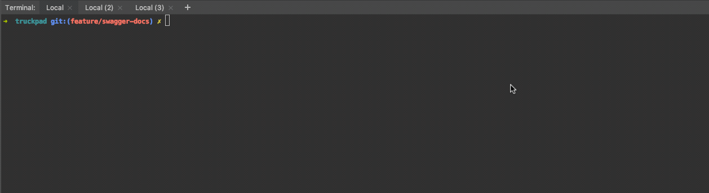
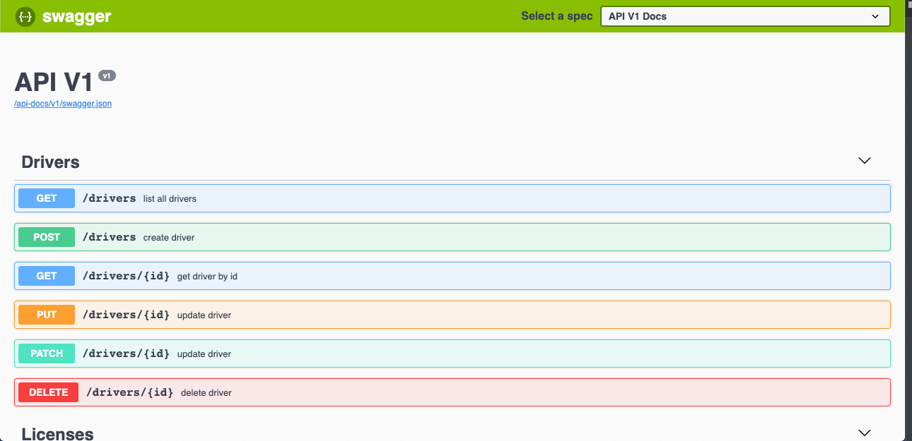

# TruckPad Challenger

Este projeto é um defasio referente a uma oportunidade na empresa [Truckpad].

### Testes Unitários

Os testes unitários foram desenvolvidos com o framework [rspec] que faz com que os teste escritos
fiquem compreensíveis até mesmo por pessoas que não façam parte de tecnologia.

#### rodas os testes

Acesse o diretório do projeto
```shell
$ cd truckpad 
```

Execute os testes
```
$ rspec 
```



---

#### Rodar em modo desenvolvimento

```shell
$ rails s
```

Agora é só abrir o seu browser e acessar o endereço http://localhost:3000/drivers

---

#### Migrar o banco de dados

````shell
$ rails db:migrate
````

---

#### Documentação API

A documentação da API foi desenvolvida utilizando o [swagger] que é uma especificação de API viva. aonde
os desenvolvedores podem ver os recursos existentes na API, quais são os seu contratos e respostas.

Para escrever a especificação foi utilizado [rspec] e [rswag].

##### configurar rswag no projeto
````shell
$ rails g rswag:install
````

##### gerar documentação atualizada swagger

````shell
$ rake rswag:specs:swaggerize
````

#### Acessar documentação viva

para acessar a documentação acesse o edereço http://APP_ADDRESS:PORT/api-docs, você estára 
na página da documentação e poderá integrarir com a API e saber os endpoints disponíveis.



### Referências

As referências que eu utilizei para realizar os desafios foram:
- [json.org]
- [json-api]
- [rails-documentation]
- [rspec]

---

[Truckpad]: <https://www.truckpad.com.br/>
[rspec]: <https://rspec.info/>
[swagger]: <https://swagger.io/>
[rswag]: <https://github.com/domaindrivendev/rswag>
[json.org]: <http://json.org/>
[json-api]: <https://jsonapi.org/>
[rails-documentation]:<https://guides.rubyonrails.org/>
[rspec]: <https://rspec.info/>